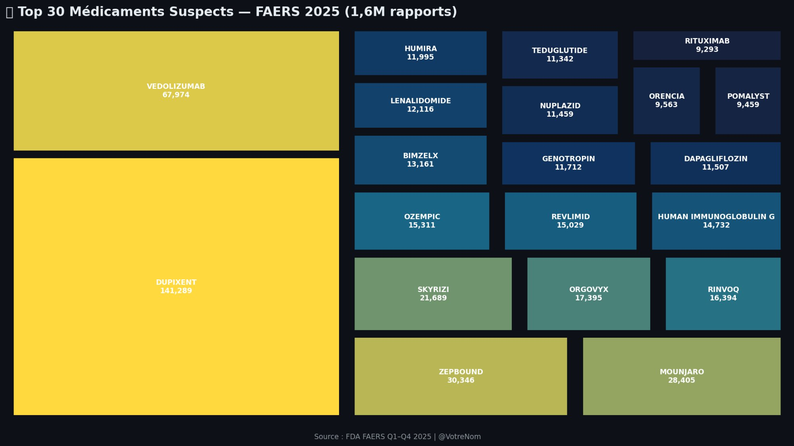
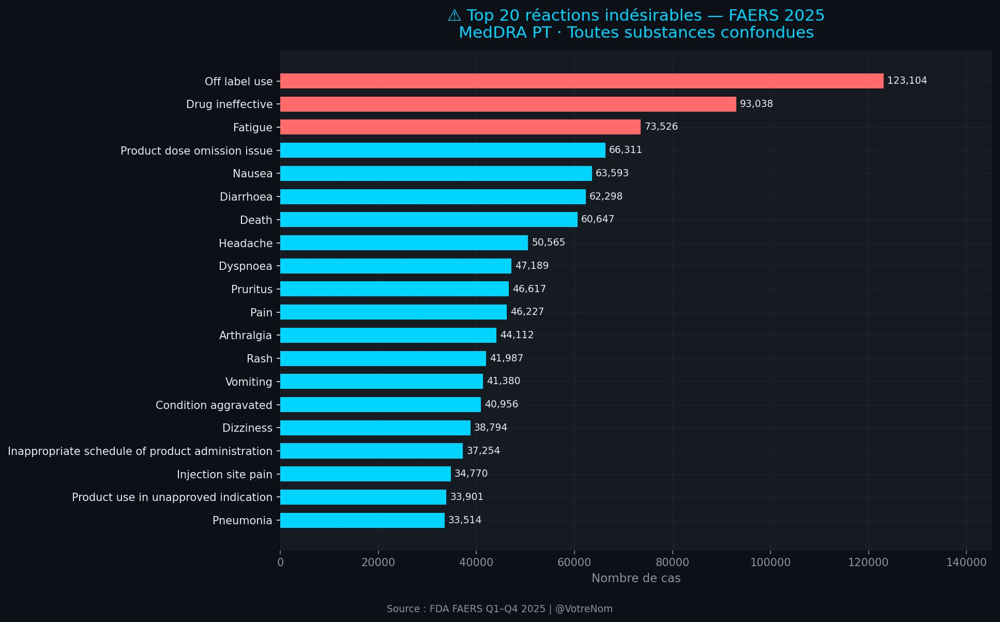
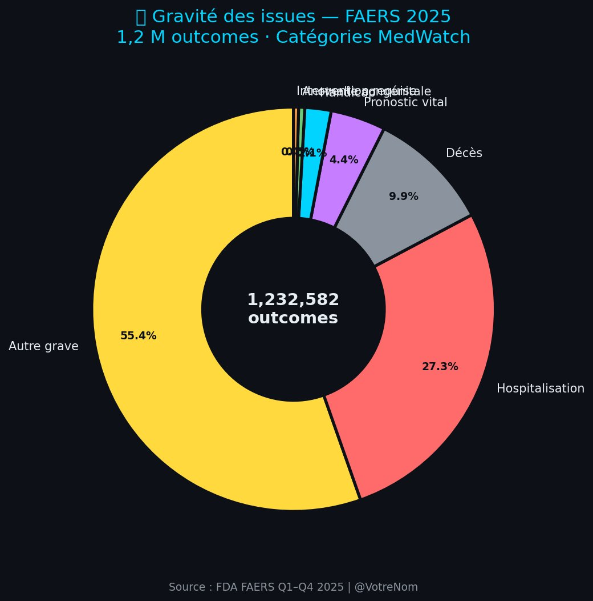
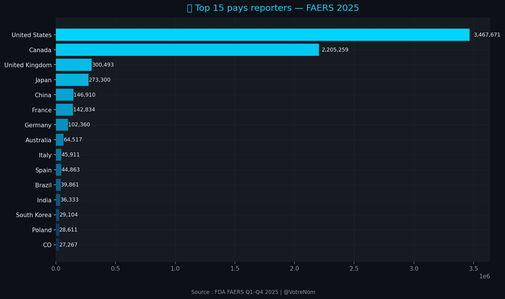
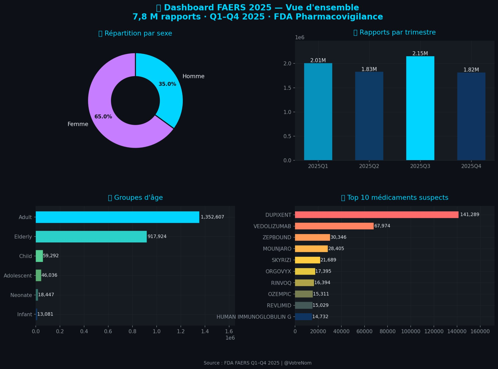

# 🧬 FDA FAERS 2025 — AI-Powered Pharmacovigilance at Scale

<div align="center">


[](https://colab.research.google.com/github/samibahig/faers-2025-pharmacovigilance/blob/main/notebooks/faers_pipeline.ipynb)

**End-to-end Big Data & AI pipeline processing 28 million FDA FAERS records**  
**Signal detection · NLP clustering · Predictive pharmacovigilance**

[📄 Read the Article](#-article) · [📊 View Visualizations](#-visualizations) · [🚀 Run the Pipeline](#-how-to-run) · [📁 Data](#-data)

</div>

---

## 📌 Project Overview

> *Can AI transform pharmacovigilance from a reactive surveillance system into a predictive, patient-specific risk assessment tool — one that flags potential toxicity before the first prescription is even written?*

This project presents a complete **Big Data & AI pharmacovigilance pipeline** built on the **FDA Adverse Event Reporting System (FAERS)** for the full year 2025 (Q1–Q4). Using Python, Google Cloud CLI, Hadoop-inspired data partitioning, NLP (TF-IDF + K-Means), and disproportionality signal detection (PRR, ROR, Chi²), I processed **28 million rows** across 7 relational tables.

**Certification:** UC San Diego — Big Data Specialization | [Verify](https://coursera.org/verify/NQB43MY3ZK7L)

---

## 📊 Key Results at a Glance

<div align="center">

| 📈 Metric | 🔢 Value |
|:---|:---|
| Total rows processed | **28,176,762** |
| Unique patient reports (DEMO) | **1,617,444** |
| Drug-reaction pairs analyzed | **7,801,018** |
| MedDRA adverse reactions (REAC) | **5,657,830** |
| Drug indications (INDI) | **4,821,589** |
| Patient outcomes (OUTC) | **1,232,582** |
| Countries reporting | **15+** |
| Confirmed signals — VEDOLIZUMAB | **716 / 2,524 reactions (28.4%)** |
| Max PRR detected | **594.5×** above background rate |
| Peak RAM usage (54 GB system) | **~5 GB** |

</div>

---

## 🔬 Visualizations

### 💊 Top 30 Suspected Drugs — FAERS 2025

*DUPIXENT dominates with 141,289 reports. GLP-1 agonists (Zepbound, Mounjaro, Ozempic) rising rapidly in 2025.*

---

### ⚠️ Top 20 Adverse Reactions (MedDRA PT)

*"Off-label use" ranks #1 (123,104 reports) — more than fatigue, nausea, or death. Critical signal for AI classifiers.*

---

### 🏥 Outcome Severity Distribution

*Over 37% of outcomes involve death (9.9%), life-threatening events, or hospitalization (27.3%) — across 1.2M documented outcomes.*

---

### 🌍 Global Reporting Map — 15+ Countries

*USA (3.46M), Canada (2.2M), UK (300K), Japan (273K) as top reporters.*

---

### 📊 FAERS 2025 — Full Dashboard

*4-panel summary: sex distribution (65% F / 35% M), quarterly volumes, age groups, top 10 drugs.*

---

## 🔍 Signal Detection: VEDOLIZUMAB Deep Dive

**518,529 drug-reaction pairs analyzed → 716 confirmed signals (28.4% rate)**

Signal confirmed when **all 3 criteria** are met simultaneously:
- ✅ **PRR ≥ 2** (Proportional Reporting Ratio)
- ✅ **Chi² ≥ 4** (p < 0.05)
- ✅ **ROR IC95 lower bound > 1**

### Top 10 Confirmed Signals

| # | Adverse Reaction | n | PRR | ROR | Chi² |
|---|---|---|---|---|---|
| 1 | Therapeutic reaction time decreased | 7,473 | **594.5** | 603.2 | 88,311 |
| 2 | Prenatal screening test abnormal | 32 | 417.5 | 417.5 | 374 |
| 3 | Cervix carcinoma stage I | 19 | 247.9 | 247.9 | 217 |
| 4 | Vascular access site bruising | 92 | 240.1 | 240.1 | 1,049 |
| 5 | Cuffitis | 48 | 208.7 | 208.8 | 542 |
| 6 | Hypoparathyroidism secondary | 16 | 208.7 | 208.7 | 181 |
| 7 | Testicular microlithiasis | 26 | 169.6 | 169.6 | 289 |
| 8 | Intestinal transit time increased | 47 | 153.3 | 153.3 | 518 |
| 9 | Anastomotic obstruction | 10 | 130.5 | 130.5 | 108 |
| 10 | GI anastomotic stenosis | 117 | 76.3 | 76.3 | 1,179 |

> ⚠️ *All signals require prospective clinical validation. PRR/ROR are screening tools, not proof of causality.*

---

## 🧠 NLP Clustering — 5 Clinical Domains Identified

Applied to 200,000 MedDRA PT strings (TF-IDF + K-Means, k=5):

| Cluster | Label | Top Terms |
|---|---|---|
| 0 | **Systemic reactions** | pain · fatigue · nausea · diarrhoea · infection |
| 1 | **Off-label & exposure** | label use · extra dose · exposure pregnancy |
| 2 | **Dosing & device errors** | dose omission · product issue · schedule |
| 3 | **Injection site reactions** | injection site · pruritus · erythema · swelling |
| 4 | **Organ-specific disorders** | gastrointestinal · cardiac · pulmonary · sleep |

> *These 5 clusters map precisely to the core safety domains used by EMA and FDA in structured benefit-risk assessment — demonstrating that unsupervised NLP can automatically reproduce expert clinical taxonomy from raw adverse event strings.*

---

## ⚙️ Technical Pipeline

```
4 × FAERS quarterly ZIP files (Q1–Q4 2025, ~8 GB compressed)
         │
         ▼
   ASCII extraction (32 raw $ -delimited files)
         │
         ▼
   load_slim() — header detection → targeted column loading
   RAM savings: DEMO 1,298 MB → 195 MB | DRUG 5,003 MB → 939 MB
         │
         ▼
   Deduplication (caseversion MAX per primaryid)
   1,617,444 → 1,617,313 unique cases
         │
         ▼
   3-table merge architecture (DEMO × DRUG → +REAC separate)
   Avoids 104M-row cartesian explosion
         │
         ├──► Descriptive Statistics (demographics, drugs, reactions)
         │
         ├──► NLP Pipeline (NLTK → TF-IDF → K-Means, k=5)
         │
         ├──► Signal Detection (PRR · ROR IC95 · Chi²)
         │
         └──► Plotly Visualizations (6 LinkedIn-ready charts)
                    │
                    ▼
              Peak RAM: ~5 GB / 54 GB available
```

### Engineering Highlights

- **`load_slim()`** — reads only file headers first, then reloads with targeted `usecols`, cutting memory by ~60%
- **Type optimization** — `int64 → int32`, high-cardinality objects → `category` dtype (−40% RAM)
- **`gc.collect()`** after every merge — immediate RAM release
- **Hadoop-inspired partitioning** — each quarter processed as independent partition, enabling unlimited scaling
- **Avoided cartesian explosion** — naive 3-table merge → 104M rows, corrected architecture → 7.8M rows

---

## 🛠️ Tech Stack

| Layer | Tools |
|---|---|
| Language | Python 3.10 |
| Data Engineering | Pandas, NumPy, gc, psutil |
| NLP | NLTK, scikit-learn (TF-IDF, K-Means) |
| Signal Detection | Custom PRR/ROR/Chi² implementation |
| Visualization | Plotly (Express + Graph Objects) |
| Infrastructure | Google Colab Pro+ (54 GB RAM), Google Cloud CLI |
| Architecture | Hadoop-inspired partitioning |
| Data Source | FDA FAERS (Public Domain) |

---

## 🗂️ Repository Structure

```
faers-2025-pharmacovigilance/
│
├── 📓 notebooks/
│   └── faers_pipeline.py           # Complete end-to-end pipeline
│
├── 📊 visualizations/
│   ├── linkedin_01_treemap_drugs.png
│   ├── linkedin_02_top_reactions.png
│   ├── linkedin_03_outcomes.png
│   ├── linkedin_04_world_map.png
│   └── linkedin_06_dashboard.png
│
├── 📁 data/processed/
│   ├── viz_top_drugs.csv
│   ├── viz_top_reactions.csv
│   ├── viz_outcomes.csv
│   ├── viz_countries.csv
│   ├── viz_quarters.csv
│   ├── viz_age_groups.csv
│   ├── viz_sex.csv
│   ├── viz_signals_vedolizumab.csv
│   └── signals_VEDOLIZUMAB_2025.csv   # Full signal detection results (2,524 rows)
│
├── 📄 article/
│   └── Article_AI_Pharamaco_FAERS2025.docx  # Full LinkedIn article
│
├── requirements.txt
├── .gitignore
└── README.md
```

---

## 🚀 How to Run

### Prerequisites
```bash
pip install -r requirements.txt
```

### Steps
1. Download the 4 FAERS quarterly ASCII ZIP files from [FDA FAERS Downloads](https://www.fda.gov/drugs/fda-adverse-event-reporting-system-faers/faers-latest-quarterly-data-files)
2. Open `notebooks/faers_pipeline.py` in **Google Colab Pro** (≥25 GB RAM recommended)
3. Run cells sequentially — upload ZIPs when prompted
4. Results export automatically as CSV + PNG

> 💡 **RAM tip:** The pipeline peaks at ~5 GB thanks to `load_slim()` and `gc.collect()`. Standard Colab (~12 GB) is sufficient if you follow the memory optimization cells.

---

## 📄 Article

The full LinkedIn article **"Using AI to Predict Patient-Specific Drug Response Using Big Data"** is available in [`article/Article_AI_Pharamaco_FAERS2025.docx`](article/Article_AI_Pharamaco_FAERS2025.docx).

**Topics covered:**
- Why drug safety needs Big Data & AI
- Dataset engineering (28M rows, 7 tables)
- Signal detection methodology (PRR, ROR, Chi²)
- NLP clustering of MedDRA reactions
- AI for predictive pharmacovigilance (XGBoost, Transformers, GNNs)
- Pharmacogenomics & precision medicine
- Real-time signal amplification (BCPNN, MGPS, Kafka + Spark)

---

## 📚 Data Source

- **FDA FAERS** — Adverse Event Reporting System, Q1–Q4 2025
- Public domain: [https://www.fda.gov/drugs/fda-adverse-event-reporting-system-faers](https://www.fda.gov/drugs/fda-adverse-event-reporting-system-faers)
- Terminology: **MedDRA PT** (Medical Dictionary for Regulatory Activities)
- Signal detection follows **EMA and FDA disproportionality guidelines**

---

## 👤 Author

**Sami Bahig**  
Data Scientist · Healthcare AI · Clinical AI Governance  
MD, MSc | MILA (Quebec AI Institute) · CRCHUM  
📍 Montréal, Québec, Canada

[](https://linkedin.com/in/samibahig)
[](https://github.com/samibahig)

**Certification:** UC San Diego — Big Data Specialization | [Verify certificate](https://coursera.org/verify/NQB43MY3ZK7L)

---

## 📄 License

Code: **MIT License** — free to use, adapt, and build upon with attribution.  
Data: **FDA Public Domain** — no restrictions.  
Article: **© Sami Bahig** — please cite if referenced.

---

<div align="center">

*⭐ If this project was useful to you, please consider starring the repo!*

`#DrugSafety` `#Pharmacovigilance` `#BigData` `#MachineLearning` `#NLP` `#HealthcareAI` `#FAERS` `#FDA` `#Python` `#Hadoop` `#PrecisionMedicine`

</div>
